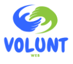

# Sistema de Gestión Humana - Proyecto Rikimaka

Repositorio del proyecto para el curso de **Diseño y Programación Web** para el Grupo #3.
Este sistema web busca optimizar la administración de proyectos, la gestión de permisos y el reporte de labores diarias para la organización **Rikimaka**.

---

## Equipo de Trabajo

| Rol | Integrante |
| :--- | :--- |
| **Coordinador** | Santiago Abril Madrigal |
| **Diseñador Web** | Jorge Daniel Leandro Quirós |
| **Desarrollador Web** | Geiner Andrey Esquivel Otárola |

---

## Descripción del Proyecto

La organización **Rikimaka** requiere la implementación de un sistema robusto que permita fortalecer la trazabilidad del trabajo y la planificación estratégica del personal. El objetivo principal es centralizar la operación administrativa, permitiendo un control eficiente sobre el tiempo, presupuestos y carga de trabajo institucional.

---

## Problema a Resolver

El sistema se divide en tres perfiles de usuario clave, cada uno con funcionalidades específicas para garantizar el flujo operativo:

### 1. Administrador de Talento Humano
Responsable de la gestión estratégica y la supervisión del capital humano.
* **Gestión de Tiempos:** Definición de días feriados y períodos de vacaciones permitidos.
* **Control de Solicitudes:** Supervisión y aprobación de periodos de descanso de los trabajadores.
* **Inteligencia de Datos:** Generación y visualización de reportes consolidados, incluyendo:
    * **Análisis de Eficiencia:** Total de horas dedicadas por proyecto vs. presupuesto y recursos asignados.
    * **Balance de Carga:** Distribución de la carga de trabajo entre los trabajadores.
    * **Métricas Operativas:** Productividad y utilización de recursos.

### 2. Trabajador / Colaborador
Usuarios encargados de la ejecución y el registro de datos operativos.
* **Autogestión de Permisos:** Solicitud de vacaciones mediante un calendario interactivo que muestra los días feriados.
* **Reporte Diario de Labores:** Registro detallado de actividades diarias especificando:
    * Proyectos en los que colaboró.
    * Actividades específicas y horas dedicadas a cada una.
    * Estado final de cada tarea (Completada, En proceso, etc.).

### 3. Personal de TI
Responsables del mantenimiento técnico y la estructura de datos del sistema.
* **Catálogo de Proyectos:** Creación y mantenimiento de los proyectos de la organización, asociando metadatos como presupuesto y recursos.
* **Gestión de Asignaciones:** Vinculación de trabajadores a los proyectos creados por el departamento de Recursos Humanos.
---

## Links para acceso rápido
* [Aplicación (Página de Inicio)](https://jorgeleandroquiros.github.io/proyecto_desarrollo_web/src/assets/html/pagina_principal.html)
    * **Página Responsive**: Corresponde a la [página principal](./src/assets/html/pagina_principal.html), la página tiene 3 diferentes respuestas a cambios de dimensiones: Menos de 300px, de 301px a 480px y más de 481px.
* [Wireframes y documentación](./docs/)
* [Archivos HTML](./src/assets/html/)
* [Archivos CSS](./src/assets/css/)
---

## Alcance del Proyecto

El proyecto consiste en el diseño y desarrollo de la interfaz web del Sistema de Gestión Humana para la organización Rikimaka, enfocándose principalmente en la experiencia visual y la experiencia del usuario. Esto incluye:

* Diseño de la interfaz gráfica (UI) para los tres perfiles: Administrador de Talento Humano, Trabajador y Personal de TI.
* Diseño del calendario interactivo para la solicitud visual de vacaciones.
* Implementación de formularios visuales para registro de labores, creación de proyectos y gestión de solicitudes.

### Alcance del Primer Entregable
* Incluye los wireframes para cada una de las páginas a ser implementadas. Adicionalmente incluye documentación básica sobre el diseño y el plan del flujo de usuario para las páginas. Los documentos a entregar corresponden a:
    * PDFs con el diseño de la página
    * Markdown con la explicación de las páginas y el flujo a seguir.

### Alcance del Segundo Entregable
* Incluye la implementación en HTML y CSS para cada uno de los wireframes propuestos durante el primer entregable. Adicionalmente incluye una página responsive para diferentes dimensiones de pantalla y dispositivos. Las siguientes páginas fueron implementadas para el entregable:
    * [Página Principal](https://jorgeleandroquiros.github.io/proyecto_desarrollo_web/src/assets/html/pagina_principal.html)
        * [Portal Administrador](https://jorgeleandroquiros.github.io/proyecto_desarrollo_web/src/assets/html/portal_admin.html)
            * [Gestion Vacaciones](https://jorgeleandroquiros.github.io/proyecto_desarrollo_web/src/assets/html/vacaciones_admin.html)
            * [Gestion Proyectos](https://jorgeleandroquiros.github.io/proyecto_desarrollo_web/src/assets/html/proyectos_admin.html)
        * [Portal IT](https://jorgeleandroquiros.github.io/proyecto_desarrollo_web/src/assets/html/portal_it.html)
            * [Nuevo Proyecto](https://jorgeleandroquiros.github.io/proyecto_desarrollo_web/src/assets/html/nuevo_proyecto.html)
            * [Gestion Colaboradores](https://jorgeleandroquiros.github.io/proyecto_desarrollo_web/src/assets/html/colaboradores.html)
            * [Gestion Proyectos](https://jorgeleandroquiros.github.io/proyecto_desarrollo_web/src/assets/html/proyectos_it.html)
        * [Portal Usuario](https://jorgeleandroquiros.github.io/proyecto_desarrollo_web/src/assets/html/portal_usuario.html)
* Adicionalmente para las páginas de Gestion Vacaciones y Portal Administrador, en la página web sucede un overlay. Para que suceda este es necesario utilizar javascript. Para este entregable los links redireccionan a [Overlay Vacaciones](https://jorgeleandroquiros.github.io/proyecto_desarrollo_web/src/assets/html/solicutd_vacaciones_overlay_vacaciones.html) y [Overlay Admin](https://jorgeleandroquiros.github.io/proyecto_desarrollo_web/src/assets/html/solicutd_vacaciones_overlay_admin.html). Estas páginas muestran el funcionamiento esperado después que el usuario utilice el link para revisar la solicitud.
    * **Nota:** Para regresar es necesario utilizar la flecha de retroceder en el navegador. La implementación de el cierre de la ventana emergente se debe de realizar utilizando Javascript.
* Cualquier funcionalidad no implementada o en desarrollo redirige a [En Construcción](https://jorgeleandroquiros.github.io/proyecto_desarrollo_web/src/assets/html/pagina_temporal.html)

## Estrategia para los Branches del Repositorio

Para el manejo del repositorio y de los diferentes elementos se seguirá la siguiente estrategia:
* Todo cambio al README.md o sobre la estructura general de los folders se realizará en master.
* Con respecto a los wireframes, se creará un branch por cada funcionalidad (Con sus respectivos wireframes). En total 3 branches:
    * Administrador
    * Usuario
    * IT
* Para la implementación y creación del HTML, CSS y JS, se creará un branch para cada página
    * Excepciones pueden aplicar en casos de templates o para css. Estos cambios pueden suceder en master con el fin de que se puedan utilizar en múltiples branches.

  
VoluntWeb 2026 &copy;
